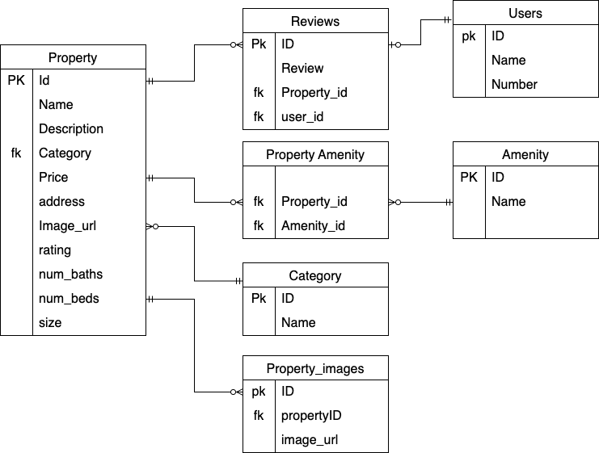

## This is a rest backend to the restate application

#### Uses the following packages
- [GIN ](github.com/gin-gonic/gin) for server
- [Ginkgo for testing](github.com/onsi/ginkgo/v2)
- [SQLX](github.com/jmoiron/sqlx) for sql based database integration

### Entity Relationship Diagram

# RealEstateGoBackEnd
